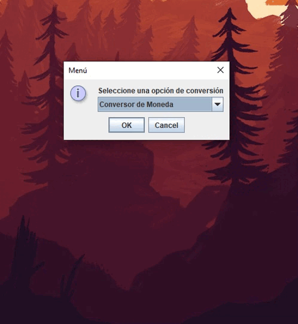

#### ONE, Oracle + Alura
# Challenge Sprint 02: Conversor de Moneda

## Descripción del proyecto
### Requisitos
- Convertir de la moneda de tu país a Dólar y viceversa
- Convertir de la moneda de tu país a Euros y viceversa
- Convertir de la moneda de tu país a Libras Esterlinas y viceversa
- Convertir de la moneda de tu país a Yen Japonés y viceversa
- Convertir de la moneda de tu país a Won sul-coreano y viceversa

## Extras
### Convesor de Temperatura
- Convertir de grados Centígrados a Farenheit y viceversa
- Convertir de grados Centígrados a Rankine y viceversa
- Convertir de grados Centígrados a Kelvin y viceversa
- Convertir de grados Farenheit a Rankine y viceversa
- Convertir de grados Farenheit a Kelvin y viceversa
- Convertir de grados Rankine a Kelvin y viceversa

## Video
<!--  -->

## Recursos
* [Java SWING](https://docs.oracle.com/javase/8/docs/api/javax/swing/JOptionPane.html)
* [XE - Convesor de Divisas](https://www.xe.com/currencyconverter/)
* [Online Convert - Conversor de video](https://www.online-convert.com/)
* [Markdown - Gif](https://qastack.mx/programming/34341808/is-there-a-way-to-add-a-gif-to-a-markdown-file)
* [Markdown - Tutorial](https://emowe.com/cerebro-digital/tutorial-de-markdown-en-espanol)
